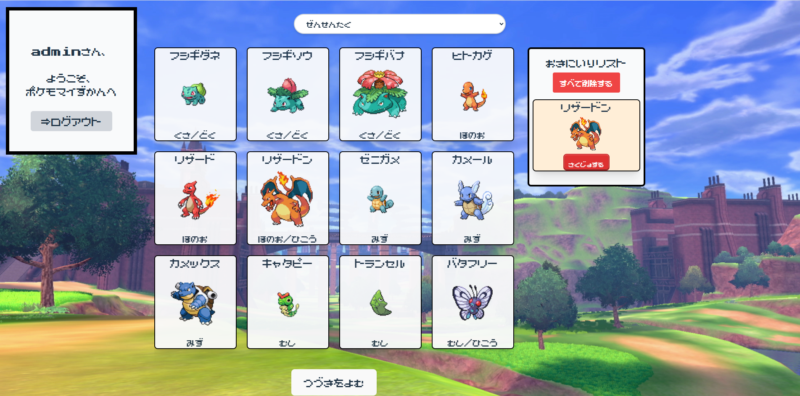
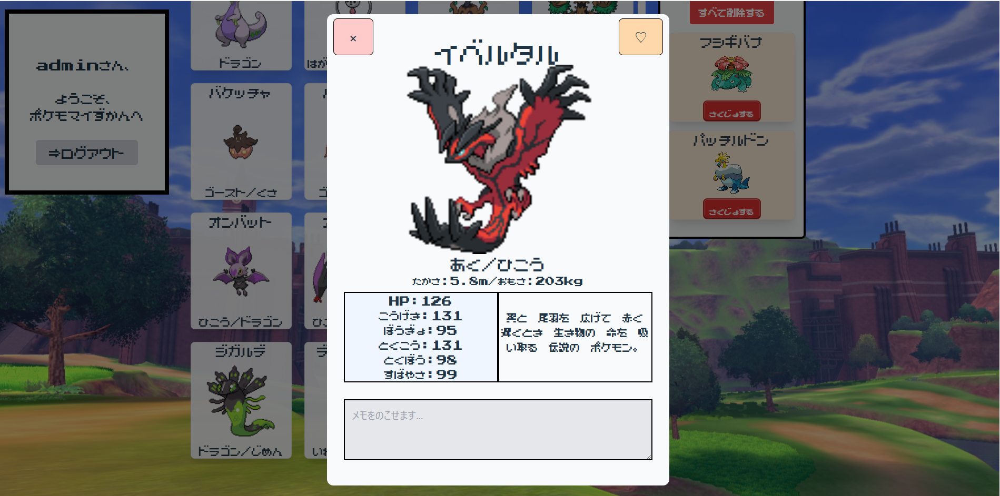

# PokemoAPI-React-App
React+PHP+MySQLを用いて作成したポケモン図鑑アプリです。
ログイン機能を実装し、ユーザのお気に入りポケモン登録とそれぞれのポケモンのメモを保存できます。
ReactとPHPを用いてフロントとバックを分離し、データ管理までの一通りを実装しました。





## 📺デモ動画

https://github.com/user-attachments/assets/cd7dcd55-a145-4400-9092-30a7d58afd57

## 📚使用技術

## フロントエンド
- React(Hooks/コンポーネント設計)
- Tailwind CSS(UIの調整のため)

## バックエンド
 
- PHP
- My SQL(ユーザデータ管理)

## その他
- PokeAPI(外部API連携)
- GitHub(README、動画共有)

## 📈DB設計

## DB構成

Tables
- **users**(id,username,password_hash)
    - (username)にユニーク制約を設定し、同じユーザ名で複数登録できないようにしました。
- **favorites**(id,user_id,pokemon_id)
    - (user_id,pokemon_id)にユニーク制約を設定し、同じポケモンを重複してお気に入り登録できないようにしました。
- **memos**(id,user_id,pokemon_id,memo_text)
    - (user_id,pokemon_id)にユニーク制約を設定し、1ユーザにつき1ポケモンに1つのメモを保持するようにしました。


## 📖機能一覧

- ログイン機能
- 世代ごとに絞り込み
- ポケモンごとの詳細情報
- ユーザごとにお気に入り・メモを管理

## 📲インストール

**- 1.リポジトリをクローンします。**

まずプロジェクトをローカルにコピーします。
```
git clone https://github.com/wataru-creato/PokemonAPI-React-App.git
cd PokemonAPI-React-App
```

**- 2.MySQLを使えるようにする。**

まずMySQLにログインします。
```
mysql -u root -p
```

MySQL内で以下を実行してデータベースを作成します。

```
CREATE DATABASE pokemon_react_app;
```

プロジェクトのルートフォルダで以下を実行し、テーブルを作成します。

```
mysql -u root -p pokemon_react_app < database/schema.sql
```

**- 3.backendフォルダのセットアップ**

backendフォルダで依存関係をインストールします。
```
cd backend
composer install
```

PHPサーバを起動します。

```
php -S localhost:8000
```

ブラウザで以下にアクセスするとAPIが動作します。
```
http://localhost:8000
```

**- 4.frontendファルダのセットアップ**

```
cd frontend
npm install
```

開発サーバを起動します。

```
npm run dev
```

ブラウザで以下にアクセスしてください。
```
http://localhost:5173
```

**- 5.データベースをセットアップ**

DB接続情報を設定するために、backendフォルダ内で以下を実行します。

windows
```
copy db_example.php db.php
```

Mac/Linux
```
cp db_example.php db.php
```

その後db.phpを開き、自分の環境のMySQLパスワードを設定してください。


## 💪工夫した点
- お気に入り・メモをDBでユーザごとに管理しました。
- React-PHP-MySQLと役割分担できる構成にし、CRUDを一通り実装しました。
- React側で「認証系(App)」と「表示系(Main)」に分離し、責任をわけることをしました。
- SQLはユーザ入力を直接使わず、不正なSQL実行を防ぐようにしました。

<details>
<summary>詳細（学んだ点・改善予定）</summary>

## 🖋学んだ点
- Cookie認証で詰まった経験から、credentials設定など通信の仕様を理解した。
- Jsでの状態管理の複雑さから、最初の設計の必要さと状態管理がしやすいReactの必要性を実感した。
- データの流れを意識して作成したので、エラーの原因特定ができるようになった。

## 🔧今後の改善予定

- 名前検索を追加することにより、目的のポケモンにすぐにたどり着けるようにする。
- 「つづきをよむ」ボタンの連打時に発生するエラーを防ぐために、ローディング制限を実装する。
- まだMainの責務が大きいので整理する。
- ローカル環境からほかの人が使えるような環境に整備する。


</details>


## コンポーネント構成

- App
- Login:認証
- Register:ユーザの新規登録
- Main:一覧表示と状態管理
- Modal:詳細表示とお気に入り、メモ編集
- PokemonCard:一覧表示
- FavoriteList:ユーザのお気に入りポケモンの情報


## State設計

状態は以下の2種類に分けて管理しました。

- 認証ユーザに依存する情報(App)
- 一覧表示など画面内で完結する情報(Main)